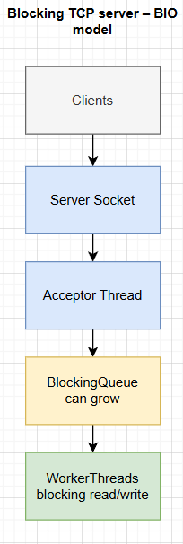

# Blocking TCP server: practical observations and bottleneck analysis

## 1. Motivation

This experiment started from a simple question:

**Where does a blocking TCP server actually become a bottleneck under load?**

Instead of relying on theory or frameworks, a blocking TCP server was implemented
from scratch to observe its real behavior under concurrent load.

The goal of this project is not optimization, but understanding
*where blocking hurts and why*.

---

## 2. Architecture

The server follows a classic blocking I/O (BIO) model,
similar to the traditional Tomcat BIO connector.




### Architecture overview

- Clients establish TCP connections
- `ServerSocket` accepts connections
- A single acceptor thread performs `accept()`
- Accepted sockets are placed into an application-level `BlockingQueue`
- Worker threads handle sockets using blocking `read()` / `write()`

The acceptor thread only accepts connections.
All blocking I/O happens inside worker threads.

---

### TCP backlog note

TCP backlog was **not** the limiting factor in the main experiments.

The acceptor thread was able to accept connections fast enough.
The bottleneck consistently appeared **after acceptance**,
at the worker thread and application queue level.

---

## 3. Configuration

Server behavior is controlled using JVM system properties.

| Property | Description | Default |
|--------|------------|--------|
| `workers` | Number of worker threads | `1` |
| `backlog` | TCP accept backlog | `50` |
| `blockingQueueCapacity` | Application queue capacity | `50` |

### Example runs

Single worker:

```bash
java -Dworkers=1 server.Server
```
More workers:
```bash
java -Dworkers=5 server.Server
```
Backpressure / failure scenario:
```bash
java -Dworkers=1 -Dbacklog=5 -DblockingQueueCapacity=5 server.Server
```

## 4. Metrics and observations
The server logs internal metrics with timestamps:
- accepted connections
- queued sockets
- dequeued sockets
- completed requests
- active workers
- queue size
- error count

This allows observing system behavior over time, not just final results.

## 5. Test cases
### Normal behavior (no failures)
| Workers | Clients | Blocking queue | Backlog | Observation |
|---------|---------|----------------|---------|--------|
| `1`     | `10`    | `50`           | `50`    | Sequential processing, low latency   |
| `1`     | `50`    | `50`           | `50`    | Queue grows rapidly, high latency      |
| `2`     | `50`    | `50`           | `50`    | Throughput improves, queue drains slowly |
| `5`     | `50`    | `100`          | `50`    | Queue reduced but not eliminated |

### Failure behavior (backpressure)

| Workers | Clients | Queue | Backlog | Observation |
|--------|---------|-------|---------|------------|
| 2 | 50 | 5 | 5 | Connection failures and timeouts observed |

### Observations

- With a small number of worker threads, requests are processed sequentially,
  even though TCP connections are accepted successfully.
- Increasing client concurrency does not immediately cause failures,
  but leads to rapid growth of the application-level queue.
- Adding more worker threads improves throughput,
  but does not eliminate blocking behavior.
- The system degrades by increasing latency rather than rejecting requests,
  which hides overload conditions.

### Interpretation

These observations show that the primary bottleneck is not TCP itself,
but the blocking I/O model combined with limited worker threads.

The application-level queue absorbs load and delays requests,
making the server appear stable while latency continuously increases.

## 6. Failure case: limited queue and backlog

When both the TCP backlog and application-level queue are limited under high load:

- some connection attempts fail
- some clients experience timeouts or connection resets

This demonstrates that backpressure must be handled explicitly.
Without proper backpressure strategies, overload manifests either as
high latency or as client-visible failures.

## 7. Key takeaways
- TCP itself is not the bottleneck
- Blocking I/O shifts the bottleneck to worker threads
- Application-level queues hide overload by increasing latency
- Limiting queues without strategy leads to failures
- Blocking models scale poorly under concurrency
This explains why non-blocking and event-driven models exist.